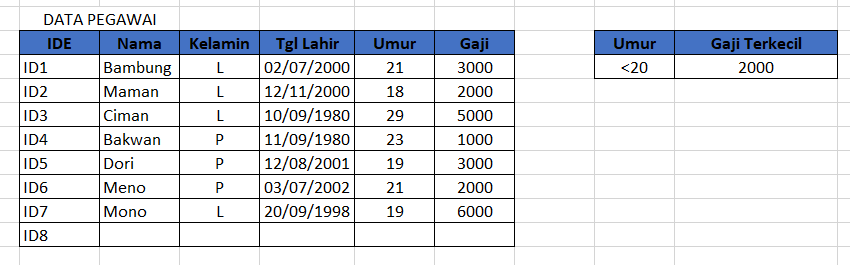

# FUNGSI DMIN

DMIN digunakan untuk mencari nilai terkecil dari data sesuai dengan kriteria yang telah ditentukan.

#### Contoh rumus:

```text
=DMIN(B3:G11;"Gaji";I3:I4)
```

_**B3:G11**_ Merupakan letak dimana data disusun.

**"**_**Gaji"**_ ****Merupakan kriteria yang diambil beradasarkan kolom.

_**I3:I4**_ Merupakan letak kriteria.

#### Contoh data yang digunakan:



