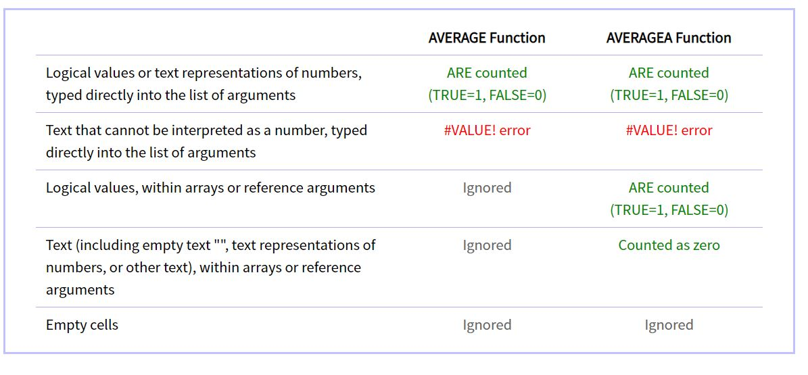
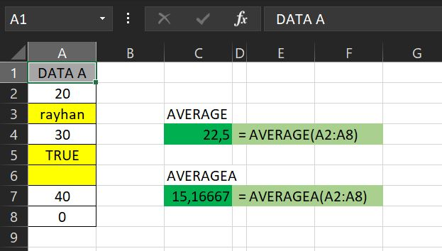

# FUNGSI AVERAGEA

### Pengertian Fungsi AVERAGEA

**Fungsi dan Rumus AVERAGEA** adalah salah satu rumus statistik pada Microsoft Office Excel yang digunakan untuk mengembalikan nilai rata-rata dari argumennya, termasuk angka, teks dan nilai logika.

Fungsi AVERAGEA mempunyai manfaat yang sama dengan penggunaan fungsi AVERAGE , yaitu menghitung nilai rata-rata dalam rentang sel yang dipilih.

**Perbedaan** antara fungsi AVERAGE dengan AVERAGEA adalah apabila fungsi average akan mengabaikan perhitungan jumlah dalam sel yang bukan merupakan angka, sedangkan fungsi averagea akan menghitung jumlah dalam sel yang juga bukan merupakan angka.  
Pada fungsi rumus AVAREGEA ini, anda dapat memasukan cell kosong, angka, teks dan nilai logika. Sedangkan pada Fungsi Rumus AVERAGE, anda hanya dapat memasukan angka saja pada argumennya.

Berikut perbedaan antara fungsi AVERAGE dan fungsi AVERAGEA :



### Sintaks Fungsi AVERAGEA pada Excel



```text
=AVERAGEA(value1, [value2], ...)
```



Sintaks atau cara penulisan fungsi excel AVERAGE di atas memiliki argumen berikut :

* **value1, value2** Value1 \[WAJIB DIISI\], nilai selanjutnya \(value2\) adalah opsional. 1 hingga 255 sel, rentang sel, atau nilai yang Anda ingin rata-ratakan.

### Contoh Implementasi Fungsi AVERAGEA

Silahkan lihat contoh implementasi fungsi AVERAGEA dalam microsoft excel berikut :



Bisa kita lihat dari contoh di atas, bahwa fungsi averagea berbeda dengan fungsi average. Perbedaan yaitu jika pada fungsi averagea sel yang berisi text dan juga sel yang berisi Logika turut diikutsertakan dalam perhitungan. Sel yang berisi text dihitung nilainya menjadi 0 sedangkan sel yang berisi logika jika TRUE maka akan dihitung nilainya menjadi 1. 

Sehingga evaluasi perhitungan fungsi averagea di atas dapat dijabarkan menjadi berikut :



```text
=(20+0+30+1+40+0)/6 = 15,16667
```




