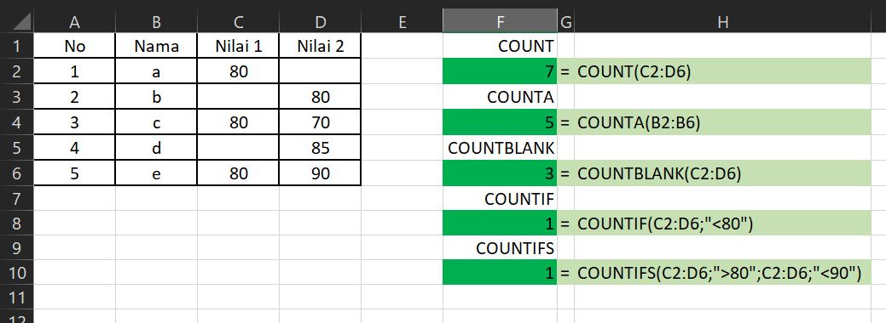

# FUNGSI COUNTBLANK

### Pengertian Fungsi **COUNTBLANK**

**Fungsi COUNTBLANK** pada Excel digunakan untuk mengetahui atau menghitung jumlah sel kosong \(empty\) pada rentang sel tertentu yang kita tentukan.

### Sintaks Fungsi COUNTBLANK pada Excel



```text
=COUNTBLANK(range)
```



Argument **range** pada fungsi COUNTBLANK ini merupakan kumpulan sel yang akan kita hitung jumlah sel kosongnya.

### Contoh Implementasi Fungsi COUNTBLANK

Silahkan lihat contoh implementasi fungsi COUNTBLANK dalam microsoft excel berikut :



