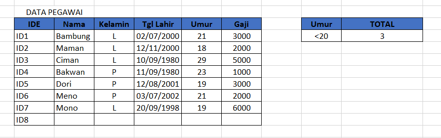

# FUNGSI DCOUNT

DCOUNT digunakan untuk menghitung berapa banyak sel yang memenuhi kriteria.

## Contoh rumus:

```text
=DCOUNT(B3:G11;"Gaji";I3:I4)
```

_**B3:G11**_ Merupakan letak dimana data disusun.

**"**_**Gaji"**_ _\*\*_Merupakan kriteria yang diambil beradasarkan kolom.

_**I3:I4**_ Merupakan letak kriteria.

## Contoh data yang digunakan:



