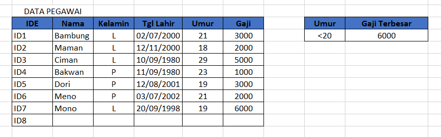

# FUNGSI DMAX

DMAX digunakan untuk mencari nilai terbesar dari sebuah data dengan kriteria yang telah ditentukan.

## Contoh rumus:

```text
=DMAX(B3:G11;"Gaji";I3:I4)
```

_**B3:G11**_ Merupakan letak dimana data disusun.

**"**_**Gaji"**_ _\*\*_Merupakan kriteria yang diambil beradasarkan kolom.

_**I3:I4**_ Merupakan letak kriteria.

## Contoh data yang digunakan:



