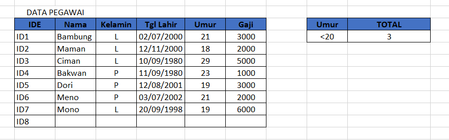

# Fungsi MINVERSE

## Deskripsi

Fungsi ini berfungsi mengembalikan nilai inverse dari suatu mariks yang disimpan dalam array.

## Sintaks Dasar

Pada umumnya fungsi ini memiliki sintaks dasar sebagai berikut.

```text
MINVE(array)
```

Sintaks fungsi MINVERSE memiliki argumen ini:

* **Array**    Diperlukan. Sebuah array numerik dengan jumlah baris dan kolom yang sama.

## Contoh Implementasi


Untuk menghasilkan array yang berisi inverse maka langkah yang harus dilakukan ialah blok rentang tertentu yang seukuran dengan array matriks, lalu masukan rumus dan tekan CTRL+SHIFT+ENTER


Berikut adalah rumus nya.

```text
=MINVERSE(A2:B3)
```



