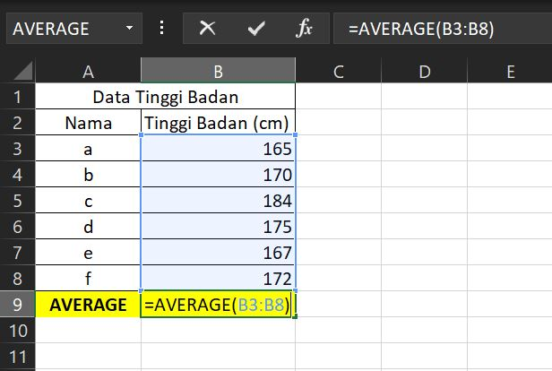
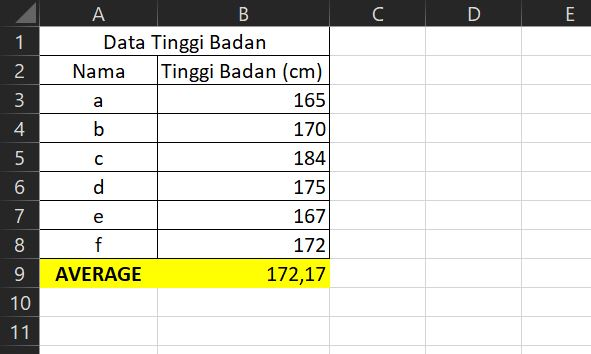
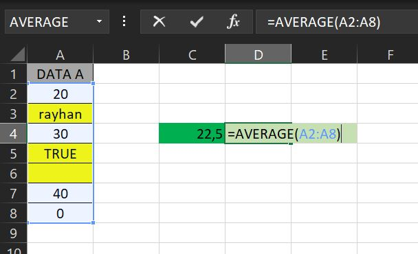

# FUNGSI AVERAGE

Dengan menggunakan Microsoft Office Excel Anda tidak akan kesulitan untuk mencari rata-rata nilai, sebab microsoft excel sudah menyediakan fungsi khusus untuk menghitung nilai rata-rata sekelompok data, yakni dengan menggunakan fungsi AVERAGE excel.

Rumus rata-rata excel sendiri merupakan sebuah rumus yang digunakan untuk menghitung jumlah nilai sekelompok data di bagi dengan banyaknya data. Pada umumnya nilai rata-rata digunakan untuk mendapatkan gambaran umum dari sebuah data.

## Pengertian Fungsi AVERAGE

**Fungsi AVERAGE** adalah salah satu fungsi microsoft excel yang digunakan menghitung rata-rata dari sekelompok nilai argumen yang diberikan pada beberapa sel atau range data. Dengan kata lain Fungsi AVERAGE adalah fungsi dalam excel yang digunakan menghitung rata-rata dari sekelompok nilai.

> **Rata-rata** merupakan nilai rata-rata aritmatika yang dihitung dengan menjumlahkan sekelompok angka kemudian membaginya dengan jumlah atau banyaknya angka tersebut.

## Sintaks Fungsi AVERAGE pada Excel



```text
=AVERAGE(number1, [number2], ...)
```



Sintaks atau cara penulisan fungsi excel AVERAGE di atas memiliki argumen berikut :

* **number1**  \[WAJIB DIISI\]. Argumen angka pertama, referensi sel, atau rentang yang akan kita hitung nilai rata-ratanya.
* **number2** \[Opsional\].  Angka tambahan lain, referensi sel, atau rentang yang ingin dihitung rata-ratanya, hingga maksimum 255.

## Contoh Implementasi Fungsi AVERAGE

Silahkan lihat contoh implementasi fungsi AVERAGE dalam microsoft excel berikut :





Pada contoh diatas, rumus average excel digunakan untuk mencari rata-rata nilai pada range B3:B8. Hasilnya adalah 172,17. Angka 172,17 ini didapat dari perhitungan rata-rata nilai berikut:



```text
(165+170+184+175+167+172)/6 = 1033/6 = 172,17
```



Lalu, Jika referensi sel atau range **berisi teks**, **nilai logika**, atau **sel kosong**, nilai-nilai itu akan diabaikan akan tetapi, sel dengan nilai nol dimasukkan/ tetap dihitung seperti pada contoh dibawah :



Maka evaluasinya akan mengabaikan sel-sel yang berisi teks \(A3\), nilai logika \(A5\) dan sel kosong \(A6\). Sehingga hanya 4 sel yang dihitung rata-ratanya.

