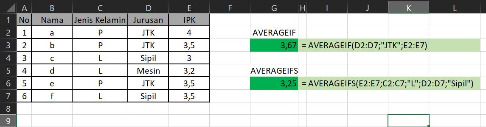

# FUNGSI AVERAGEIF

## Pengertian Fungsi AVERAGEIF

**Fungsi AVERAGEIF** adalah salah satu fungsi statistik pada excel yang digunakan untuk menghitung nilai rata-rata dengan sebuah kriteria atau syarat tertentu.

## Sintaks Fungsi AVERAGEIF pada Excel



```text
=AVERAGEIF(Range; Criteria; [Average_range])
```



Sintaks atau cara penulisan fungsi excel AVERAGEIFS di atas memiliki argumen berikut :

* **Range** Merupakan range data yang akan kita cocokkan dengan kriteria. Dapat berupa sel, range , sekumpulan angka, named range, array maupun referensi sel.
* **Criteria** Merupakan kondisi/syarat/kriteria yang akan menentukan sel/ nilai mana saja yang akan kita jadikan dasar menghitung rata-rata. Bisa berupa angka, ekspresi logika, teks maupun referensi sel.
* **Average\_range**

  Argumen ini bersifat opsional \(bisa diisi atau tidak\), yakni Range data yang akan dihitung rata-ratanya. Jika dikosongkan atau tidak diisi maka yang akan digunakan adalah argumen Range.

## Contoh Implementasi Fungsi AVERAGEIF

Silahkan lihat contoh implementasi fungsi AVERAGEIF dalam microsoft excel berikut :



