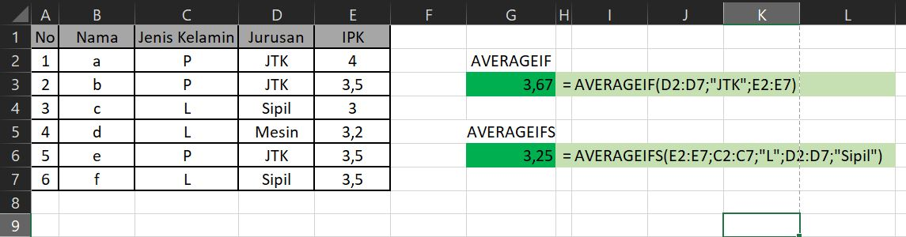

# FUNGSI AVERAGEIFS

## Pengertian Fungsi AVERAGEIFS

**Fungsi AVERAGEIFS** adalah rumus excel yang digunakan untuk menghitung rata-rata nilai sekumpulan data yang memenuhi beberapa kriteria. Dengan rumus AVERAGEIFS kita bisa menghitung atau mencari rata-rata dengan banyak syarat atau kondisi tertentu.

Dengan **fungsi AVERAGEIFS** kita bisa menetapkan sampai 127 kriteria atau kondisi untuk menghitung rata-rata sekumpulan data.

## Sintaks Fungsi AVERAGEIFS pada Excel



```text
=AVERAGEIFS( average_range, criteria_range1, criteria1, [criteria_range2, criteria2], ... )
```



Sintaks atau cara penulisan fungsi excel AVERAGEIFS di atas memiliki argumen berikut :

* **AverageRange** Merupakan sekumpulan data yang akan kita hitung nilai rata-ratanya. Argument ini dapat berupa angka, sel, range, named range, array, atau referensi range data.
* **CriteriaRange1** Merupakan range data yang akan kita cocokkan dengan kriteria pertama yang diterapkan.
* **Criteria1** Merupakan syarat pertama yang akan digunakan untuk mengevaluasi argument CriteriaRange1.
* **CriteriaRange2; Criteria2;...** Argumen yang berisi pasangan antara sekumpulan data dan syarat selanjutnya. Argumen ini bersifat opsional \(Bisa diisi atau dikosongkan\). Maksimal samapai 127 Kriteria

## Contoh Implementasi Fungsi AVERAGEIFS

Silahkan lihat contoh implementasi fungsi AVERAGEIFS dalam microsoft excel berikut :



