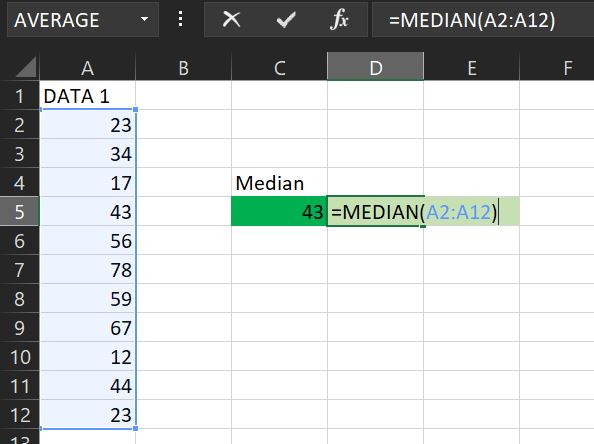

# FUNGSI MEDIAN

## Pengertian Fungsi **MEDIAN**

**Fungsi Median** merupakan fungsi untuk mengembalikan atau menghasilkan median statistik atau nilai tengah dari serangkaian nilai yang disediakan. Median adalah angka yang berada di tengah serangkaian angka.

## Sintaks Fungsi MEDIAN pada Excel



```text
=MEDIAN(number1, [number2], ...)
```



Sintaks atau cara penulisan fungsi excel AVERAGEIFS di atas memiliki argumen berikut :

* **number1, number2...** Argumen fungsi MEDIAN ini dapat berupa nilai numerik, larik \(range\) nilai numerik atau acuan \(reference\) ke nilai numerik. Argumen pertama \(**number1**\) diperlukan di dalam fungsi MEDIAN, sedangkan argumen berikutnya \(number2,dst...\) bersifat opsional artinya Anda bisa menyertakan dan bisa juga tidak.

## Contoh Implementasi Fungsi MEDIAN

Silahkan lihat contoh implementasi fungsi MEDIAN dalam microsoft excel berikut :



