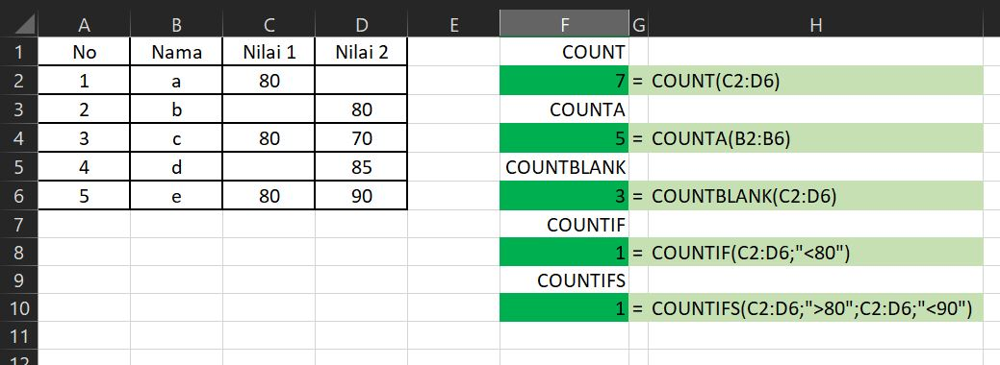

# FUNGSI COUNTIFS

## Pengertian Fungsi **COUNTIFS**

**Fungsi COUNTIFS** digunakan untuk mengetahui dan menghitung jumlah data atau sel yang memenuhi banyak kriteria. Rumus excel COUNTIFS ini sebenarnya mirip dengan rumus COUNTIF Excel yakni sama-sama menghitung jumlah cell pada sebuah rentang data \(Data Range\) yang memenuhi kriteria tertentu. Perbedaanya terletak pada jumlah kriteria atau syarat cell yang akan dihitung atau dicacah.

Jika Fungsi COUNTIF hanya menghitung Cell dengan syarat tunggal, fungsi COUNTIFS dapat menghitung jumlah atau banyaknya cell yang memenuhi lebih dari satu syarat atau kriteria.

## Sintaks Fungsi COUNTIFS pada Excel



```text
=COUNTIFS( criteria_range1, criteria1, [criteria_range2, criteria2], ... )
```



Sintaks atau cara penulisan fungsi excel COUNTIF di atas memiliki argumen berikut :

* **criteria\_range1** Sebuah rentang sel yang akan dievaluasi berdasarkan syarat tertentu
* **criteria1** Kriteria yang akan diterapkan pada rentang sel pertama
* **criteria\_range2** Sebuah rentang sel kedua yang akan dievaluasi berdasarkan syarat tertentu 
* **criteria2** Kriteria yang akan diterapkan pada rentang sel pertama.

## Contoh Implementasi Fungsi COUNTIFS

Silahkan lihat contoh implementasi fungsi COUNTIFS dalam microsoft excel berikut :



