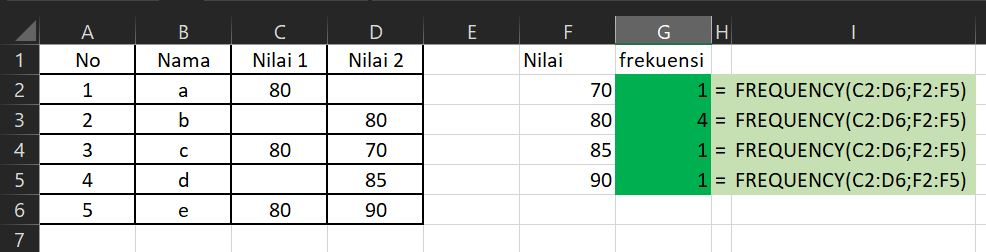

# FUNGSI FREQUENCY

## Pengertian Fungsi **COUNTIFS**

**Fungsi FREQUENCY** Adalah Fungsi Excel yang digunakan untuk menghitung kemunculan \(frekuensi\) nilai dari sebuah rentang data dalam bentuk Array Vertikal.

## Sintaks Fungsi **FREQUENCY**  pada Excel



```text
=FREQUENCY(ArrayData; ArrayBins)
```



Sintaks atau cara penulisan fungsi excel **FREQUENCY** di atas memiliki argumen berikut :

* **ArrayData** Rentang data yang akan kita hitung nilai distribusi frekuensinya. ArrayData disini bisa diisi dengan referensi range \(alamat sel\) atau sebuah nilai array.
* **ArrayBins** Merupakan nilai interval pengelompokan data dalam bentuk referensi range atau alamat sel maupun nilai array. Argumen ArrayBins ini digunakan sebagai acuan untuk mengelompokkan nilai dalam ArrayData.

## Contoh Implementasi Fungsi **FREQUENCY**

Silahkan lihat contoh implementasi fungsi **FREQUENCY** dalam microsoft excel berikut :



